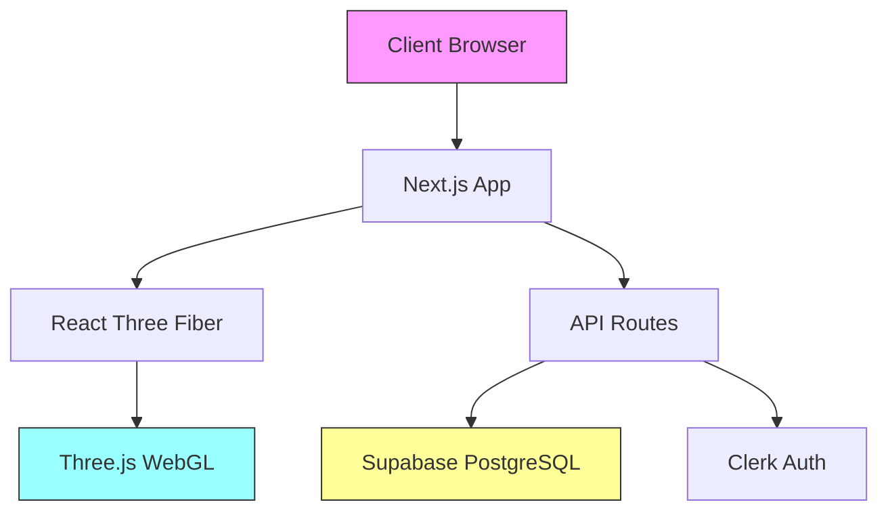

# Technical Architecture

## Overview

Echoes in Orbit is built on a modern web stack combining 3D rendering, real-time database, and serverless architecture.

---

## System Architecture



---

## Spherical Distribution Algorithm {#spherical-distribution}

### Mathematical Foundation

Stars are positioned on a sphere using spherical coordinates (θ, φ) converted to Cartesian (x, y, z):

```
x = radius × sin(φ) × cos(θ)
y = radius × cos(φ)
z = radius × sin(φ) × sin(θ)
```

**Parameters:**
- `radius` = 200 units (planetarium dome)
- `θ` (theta) = azimuthal angle (0 to 2π)
- `φ` (phi) = polar angle (0 to π)

### Fibonacci Sphere Distribution

To prevent clustering, we use the golden angle:

```typescript
const goldenRatio = (1 + √5) / 2
const goldenAngle = 2π / goldenRatio²

theta = zoneStart + (index × goldenAngle) % zoneRange
phi = zoneStart + (index / totalStars) × zoneRange
```

### Category Zones

| Category | Zone | Theta Range | Phi Range |
|----------|------|-------------|-----------|
| Hope | Top-front-right | 0° - 72° | 0° - 90° |
| Regret | Top-back-left | 72° - 144° | 0° - 90° |
| Advice | Middle band | 144° - 216° | 45° - 135° |
| Dream | Bottom-front-right | 216° - 288° | 90° - 180° |
| Gratitude | Bottom-back-left | 288° - 360° | 90° - 180° |

---

## Camera System {#camera-system}

### Configuration

```typescript
<Canvas
  camera={{ 
    position: [0, 0, 0],  // Center of sphere
    fov: 75               // Wide field of view
  }}
/>
```

### Controls

- **OrbitControls**: Rotate view around center point
- **Damping**: Smooth camera movement
- **Zoom Limits**: Min 50, Max 500 units

---

## Challenges & Solutions {#challenges-solutions}

### 1. Sphere Scale & Visibility

**Problem**: Initial 500-unit sphere made stars appear tiny.

**Solution**: 
- Reduced sphere radius to 200 units
- Increased star sizes (30-45 units)
- Positioned camera at (0,0,0)

### 2. Star Distribution Clustering

**Problem**: Random distribution created visible clusters.

**Solution**: 
- Implemented Fibonacci sphere algorithm
- Added organic noise (±0.15-0.3 radians)
- Zone-based category mapping

### 3. Click Detection on Points

**Problem**: Three.js Points have poor raycasting.

**Solution**: 
- Created invisible sphere meshes (radius 2) at each star
- Visual Points for glow, spheres for interaction

### 4. WebGL Context Errors

**Problem**: Some browsers fail to create WebGL context.

**Solution**: 
- Added error boundary with detection
- Fallback UI with troubleshooting steps

---

## Database Schema {#database-schema}

### Messages Table

```sql
CREATE TABLE messages (
  id UUID PRIMARY KEY DEFAULT uuid_generate_v4(),
  content TEXT NOT NULL,
  category TEXT NOT NULL,
  visibility TEXT DEFAULT 'public',
  delivery_date TIMESTAMPTZ,
  position_x FLOAT NOT NULL,
  position_y FLOAT NOT NULL,
  position_z FLOAT NOT NULL,
  user_id TEXT,
  session_id TEXT,
  likes INTEGER DEFAULT 0,
  created_at TIMESTAMPTZ DEFAULT NOW()
);
```

### Comments Table

```sql
CREATE TABLE comments (
  id UUID PRIMARY KEY DEFAULT uuid_generate_v4(),
  message_id UUID REFERENCES messages(id) ON DELETE CASCADE,
  user_id TEXT,
  session_id TEXT,
  content TEXT NOT NULL,
  created_at TIMESTAMPTZ DEFAULT NOW()
);
```

### Likes Table

```sql
CREATE TABLE likes (
  message_id UUID REFERENCES messages(id) ON DELETE CASCADE,
  user_id TEXT,
  session_id TEXT,
  created_at TIMESTAMPTZ DEFAULT NOW(),
  PRIMARY KEY (message_id, COALESCE(user_id, session_id))
);
```

---

## Visual Effects

### Pulsing Stars

Custom shader with time-based sine wave:

```glsl
uniform float uTime;
float pulse = 1.0 + sin(uTime * 0.5 + position.x * 0.1) * 0.1;
gl_PointSize = size * pulse * (300.0 / -mvPosition.z);
```

### Constellation Lines

- Connects nearest neighbors within galaxies
- Uses THREE.Line with BufferGeometry
- Color-coded by category
- 15% opacity for subtlety

### Dome Grid

- Spherical wireframe (200-unit radius)
- 24 radial lines (longitude)
- 12 latitude rings
- Point-based rendering for performance

---

## Performance Optimizations

1. **Instanced Rendering**: Single draw call for all stars
2. **Buffer Geometry**: Efficient vertex data storage
3. **Shader Materials**: GPU-accelerated rendering
4. **Lazy Loading**: Components load on demand
5. **Static Generation**: Pre-render pages at build time

---

## API Endpoints

### GET /api/messages

Fetch all visible stars.

**Query Parameters:**
- `sessionId` (optional): Anonymous session ID

**Response:**
```json
[
  {
    "id": "uuid",
    "position": [x, y, z],
    "isLocked": false,
    "likes": 5,
    "category": "hope"
  }
]
```

### POST /api/messages

Create a new echo.

**Body:**
```json
{
  "content": "string (10-500 chars)",
  "category": "hope|regret|advice|dream|gratitude",
  "visibility": "public|private",
  "deliveryDate": "ISO 8601 string (optional)",
  "sessionId": "string (optional)"
}
```

### GET /api/messages/[id]

Get specific message details.

### POST /api/messages/[id]/like

Toggle like on a message.

### GET /api/messages/[id]/comments

Get comments for a message.

### POST /api/messages/[id]/comments

Add comment to a message.

---

## Security

- **Row Level Security**: Supabase RLS policies
- **Authentication**: Clerk JWT validation
- **Rate Limiting**: Vercel edge functions
- **Input Validation**: Zod schemas
- **XSS Protection**: React auto-escaping

---

## Monitoring

- **Error Tracking**: Vercel Analytics
- **Performance**: Web Vitals
- **Database**: Supabase Dashboard
- **Logs**: Vercel Function Logs
